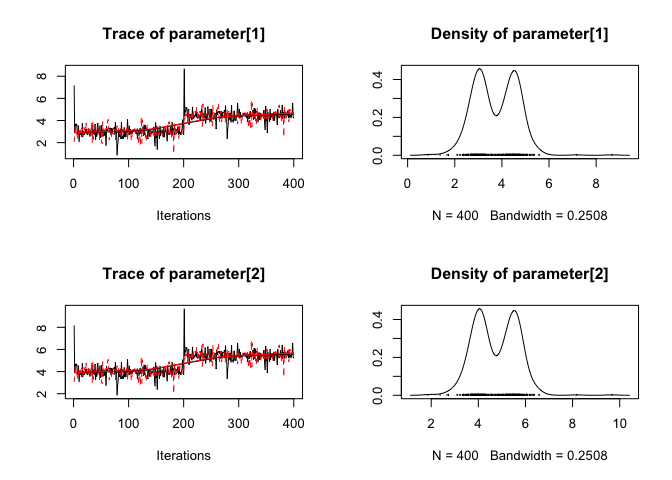
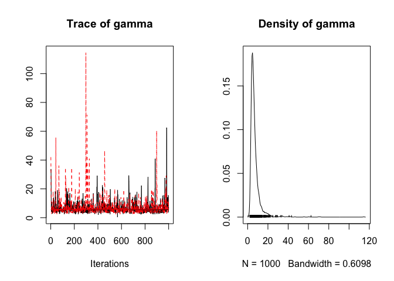

<!-- README.md is generated from README.Rmd. Please edit that file -->

[](https://github.com/joethorley/stability-badges#experimental)
[](https://travis-ci.org/poissonconsulting/mcmcr)
[](https://ci.appveyor.com/project/poissonconsulting/mcmcr)
[](https://codecov.io/github/poissonconsulting/mcmcr?branch=master)
[](https://opensource.org/licenses/MIT)

# mcmcr

## Introduction

`mcmcr` is an R package to manipulate Monte Carlo Markov Chain (MCMC)
samples.

For the purposes of this discussion, an MCMC sample represents the value
of a term from a single iteration of a single chain (of a single
analysis). And while a simple parameter such as an intercept corresponds
to a single term, more complex parameters such as an interaction between
two factors consist of multiple terms with their own inherent
dimensionality - in this case a matrix. Not surprisingly a set of MCMC
samples can be stored in different ways. The three most common S3
classes store MCMC samples as follows:

  - `coda::mcmc` stores the MCMC samples from a single chain as a matrix
    where each each row represents an iteration and each column
    represents a variable
  - `coda::mcmc.list` stores multiple `mcmc` objects (with identical
    dimensions) as a list where each object represents a parallel chain
  - `rjags::mcarray` stores the samples from multiple parallel chains as
    an array where the first dimension is variables, the second
    dimension is the iterations and the third dimension is the chains.

In all threes cases the terms/parameters are represented by a single
dimension which means that the dimensionality inherent in the parameters
is stored in the labelling of the variables, ie, `"bIntercept",
"bInteraction[1,2]", "bInteraction[2,1]", ...`. The structure of the
`mcmc` and `mcmc.list` objects emphasizes the time-series nature of MCMC
samples and is optimized for thining. According to the documentation the
`mcarray` preserve the dimensions of the original node array defined in
a JAGS model.

The `mcmcr` packages introduces two related S3 classes which preserve
the dimensionality of the parameters:

  - `mcmcr::mcmcarray` stores the samples for a single parameter from
    one or more chains where the first dimension is the chains, the
    second dimension is iterations and the subsequent dimensions
    represent the dimensionality of the parameter;
  - `mcmcr::mcmcr` stores the samples for multiple uniquely named
    parameters with the same number of chains and iterations.

The `mcmcr` package also introduces a third S3 class, `mcmcr::mcmcrs`,
which stores multiple `mcmcr` objects representing individual analyses.

## Why mcmcr?

The `mcmcarray`, `mcmcr` and `mcmcrs` classes were designed to be easy
to manipulate. As a result, the `mcmcr` package introduces a variety of
generic classes to:

  - `subset` individual objects by chains, iterations or parameters;
  - `collapse` or `split` an object’s chains;
  - `bind` multiple objects by their parameters, chains, iterations or
    terms;
  - `combine` multiple objects by summing or otherwise combining their
    values;
  - `mcmc_map` over an objects values;
  - assess if an object has `converged` using `rhat` and `esr`
    (effectively sampling rate);
  - and of course `coef`, `coerce`, `print`, `plot` etc said objects.

Finally, the mcmcr package allows the user to readily `derive` an
`mcmcr` object of new parameters (with potentially novel dimensionality)
from an existing mcmc object by using standard R code to define the
relationship between the ‘primary’ parameters in the existing object and
the ‘derived’ parameters in the created object (and any other values
specified by the user). No more rerunning a model because you forget to
include a derived parameter\!

## Demonstration

``` r
library(mcmcr)

mcmcr <- mcmcr:::mcmcr

mcmcr
#> $alpha
#> [1] 2.998247 3.998247
#> nchains:  2 
#> niters:  1000 
#> 
#> $beta
#>          [,1]    [,2]
#> [1,] 1.265929 1.33237
#> [2,] 2.265929 2.33237
#> nchains:  2 
#> niters:  1000 
#> 
#> $sigma
#> [1] 0.8265352
#> nchains:  2 
#> niters:  1000

parameters(mcmcr)
#> [1] "alpha" "beta"  "sigma"
nchains(mcmcr)
#> [1] 2
niters(mcmcr)
#> [1] 1000
nterms(mcmcr)
#> [1] 7

coef(mcmcr)
#> # A tibble: 7 x 7
#>   term       estimate    sd zscore lower upper   pvalue
#> * <S3: term>    <dbl> <dbl>  <dbl> <dbl> <dbl>    <dbl>
#> 1 alpha[1]      3.00  0.520   5.78 2.01   4.00 0.00100 
#> 2 alpha[2]      4.00  0.520   7.70 3.01   5.00 0.000500
#> 3 beta[1,1]     1.27  0.622   2.05 0.160  2.33 0.0230  
#> 4 beta[2,1]     2.27  0.622   3.66 1.16   3.33 0.00100 
#> 5 beta[1,2]     1.33  0.619   2.12 0.277  2.40 0.0150  
#> 6 beta[2,2]     2.33  0.619   3.74 1.28   3.40 0.00200 
#> 7 sigma         0.827 0.664   1.52 0.424  2.73 0.000500
rhat(mcmcr, by = "term")
#> $alpha
#> [1] 1 1
#> 
#> $beta
#>      [,1] [,2]
#> [1,] 1.85 1.87
#> [2,] 1.85 1.87
#> 
#> $sigma
#> [1] 1
esr(mcmcr)
#> [1] 0
converged(mcmcr)
#> [1] FALSE
plot(mcmcr[["alpha"]])
```

<!-- -->

``` r

mcmcr2 <- derive(mcmcr, "gamma <- sum(alpha) * sigma")
rhat(mcmcr2)
#> [1] 1.01
plot(mcmcr2)
```

<!-- -->

## Installation

To install the latest version from GitHub

    # install.packages("devtools")
    devtools::install_github("poissonconsulting/mcmcr")

## Citation

``` 

To cite package 'mcmcr' in publications use:

  Joe Thorley (2018). mcmcr: Manipulate MCMC Samples. R package
  version 0.0.0.9043.

A BibTeX entry for LaTeX users is

  @Manual{,
    title = {mcmcr: Manipulate MCMC Samples},
    author = {Joe Thorley},
    year = {2018},
    note = {R package version 0.0.0.9043},
  }
```

## Contribution

Please report any
[issues](https://github.com/poissonconsulting/mcmcr/issues).

[Pull requests](https://github.com/poissonconsulting/mcmcr/pulls) are
always welcome.

Please note that this project is released with a [Contributor Code of
Conduct](CONDUCT.md). By participating in this project you agree to
abide by its terms.

## Inspiration

[coda](https://github.com/cran/coda) and
[rjags](https://github.com/cran/rjags)
