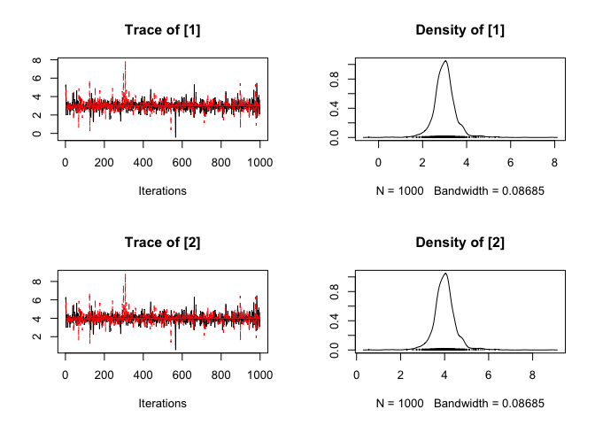

<!-- README.md is generated from README.Rmd. Please edit that file -->
[](https://travis-ci.org/poissonconsulting/mcmcr) [](https://ci.appveyor.com/project/poissonconsulting/mcmcr) [](https://codecov.io/github/poissonconsulting/mcmcr?branch=master)

mcmcr
=====

Introduction
------------

`mcmcr` is an R package to manipulate Monte Carlo Markov Chain samples.

Utilisation
-----------

``` r
library(mcmcr)

mcmcr <- mcmcr:::mcmcr

coef(mcmcr)
#> NULL
convergence(mcmcr)
#> [1] 1.734326

plot(mcmcr[[3]])
```



Installation
------------

To install the latest version from GitHub

    # install.packages("devtools")
    devtools::install_github("poissonconsulting/mcmcr")

Contribution
------------

Please report any [issues](https://github.com/poissonconsulting/mcmcr/issues).

[Pull requests](https://github.com/poissonconsulting/mcmcr/pulls) are always welcome.

Inspiration
-----------

-   coda and rjags
