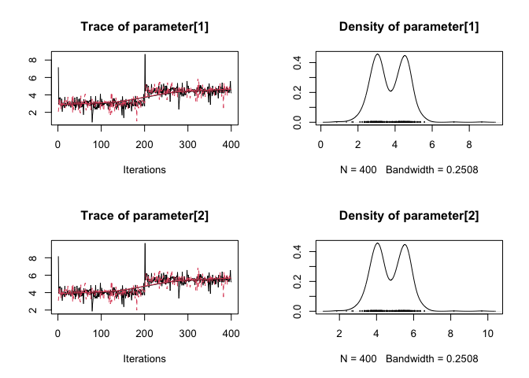

<!-- README.md is generated from README.Rmd. Please edit that file -->

# mcmcr

<!-- badges: start -->

[](https://www.tidyverse.org/lifecycle/#maturing)
[](https://travis-ci.org/poissonconsulting/mcmcr)
[](https://ci.appveyor.com/project/poissonconsulting/mcmcr)
[](https://codecov.io/github/poissonconsulting/mcmcr?branch=master)
[](https://opensource.org/licenses/MIT)
[](https://CRAN.R-project.org/package=mcmcr)
[](https://cran.r-project.org/package=mcmcr)

<!-- badges: end -->

`mcmcr` is an R package to manipulate Monte Carlo Markov Chain (MCMC)
samples (Brooks et al. 2011).

## Installation

To install the latest release version from
[CRAN](https://cran.r-project.org)

``` r
install.packages("mcmcr")
```

To install the latest development version from
[GitHub](https://github.com/poissonconsulting/mcmcr)

``` r
# install.packages("remotes")
remotes::install_github("poissonconsulting/mcmcr")
```

## Introduction

For the purposes of this discussion, an MCMC *sample* represents the
value of a *term* from a single *iteration* of a single *chain*. While a
simple *parameter* such as an intercept corresponds to a single term,
more complex parameters such as an interaction between two factors
consists of multiple terms with their own inherent dimensionality - in
this case a matrix. A set of MCMC samples can be stored in different
ways.

### Existing Classes

The three most common S3 classes store MCMC samples as follows:

  - `coda::mcmc` stores the MCMC samples from a single chain as a matrix
    where each each row represents an iteration and each column
    represents a variable
  - `coda::mcmc.list` stores multiple `mcmc` objects (with identical
    dimensions) as a list where each object represents a parallel chain
  - `rjags::mcarray` stores the samples from a single parameter where
    the initial dimensions are the parameter dimensions, the second to
    last dimension is iterations and the last dimension is chains.

In the first two cases the terms/parameters are represented by a single
dimension which means that the dimensionality inherent in the parameters
is stored in the labelling of the variables, ie, `"bIntercept",
"bInteraction[1,2]", "bInteraction[2,1]", ...`. The structure of the
`mcmc` and `mcmc.list` objects emphasizes the time-series nature of MCMC
samples and is optimized for thining. In contrast `mcarray` objects
preserve the dimensionality of the parameters.

### New Classes

The `mcmcr` package defines three related S3 classes which also preserve
the dimensionality of the parameters:

  - `mcmcr::mcmcarray` is very similar to `rjags::mcarray` except that
    the first dimension is the chains, the second dimension is
    iterations and the subsequent dimensions represent the
    dimensionality of the parameter (it is called `mcmcarray` to
    emphasize that the MCMC dimensions ie the chains and iterations come
    first);
  - `mcmcr::mcmcr` stores multiple uniquely named `mcmcarray` objects
    with the same number of chains and iterations.
  - `mcmcr::mcmcrs` stores multiple `mcmcr` objects with the same
    parameters, chains and iterations.

All five classes (`mcmc`, `mcmc.list`, `mcarray`, `mcmcarray`, `mcmcr`
and `mcmcrs`) are collectively referred to as MCMC objects.

## Why mcmcr?

`mcmcarray` objects were developed to facilitate manipulation of the
MCMC samples. `mcmcr` objects were developed to allow a set of
dimensionality preserving parameters from a single analysis to be
manipulated as a whole. `mcmcrs` objects were developed to allow the
results of multiple analyses using the same model to be manipulated
together.

The `mcmcr` package (together with the
[term](https://github.com/poissonconsulting/term) and
[nlist](https://github.com/poissonconsulting/nlist) packages) introduces
a variety of (often) generic functions to manipulate and query
`mcmcarray`, `mcmcr` and `mcmcrs` objects (and `term` and `nlist` and
`nlists` objects).

In particular it provides functions to

  - coerce from and to `mcarray`, `mcmc` and `mcmc.list` objects;
  - extract an objects `coef` table (as a tibble);
  - query an object’s `nchains`, `niters`, `term::npars`,
    `term::nterms`, `nlist::nsims` and `nlist::nsams` as well as it’s
    parameter dimensions (`term::pdims`) and term indices
    (`term::tindex`);
  - `subset` objects by chains, iterations and/or parameters;
  - `bind_xx` a pair of objects by their `xx_chains`, `xx_iterations`,
    `xx_parameters` or (parameter) `xx_dimensions`;
  - combine the samples of two (or more) MCMC objects using
    `combine_samples` (or `combine_samples_n`) or combine the samples of
    a single MCMC object by reducing its dimensions using
    `combine_dimensions`;
  - `collapse_chains` or `split_chains` an object’s chains;
  - `mcmc_map` over an objects values;
  - transpose an objects parameter dimensions using `mcmc_aperm`;
  - assess if an object has `converged` using `rhat` and `esr`
    (effectively sampling rate);
  - and of course `thin`, `rhat`, `ess` (effective sample size),
    `print`, `plot` etc said objects.

The code is opinionated which has the advantage of providing a small set
of stream-lined functions. For example the only ‘convergence’ metric is
the uncorrected, untransformed, univariate split R-hat (potential scale
reduction factor). If you can convince me that additional features are
important I will add them or accept a pull request (see below).
Alternatively you might want to use the `mcmcr` package to manipulate
your samples before coercing them to an `mcmc.list` to take advantage of
all the summary functions in packages such as `coda`.

## Demonstration

``` r
library(mcmcr)

mcmcr_example
#> $alpha
#> [1] 3.718025 4.718025
#> 
#> nchains:  2 
#> niters:  400 
#> 
#> $beta
#>           [,1]     [,2]
#> [1,] 0.9716535 1.971654
#> [2,] 1.9716535 2.971654
#> 
#> nchains:  2 
#> niters:  400 
#> 
#> $sigma
#> [1] 0.7911975
#> 
#> nchains:  2 
#> niters:  400

coef(mcmcr_example)
#>        term  estimate        sd   zscore     lower    upper pvalue
#> 1  alpha[1] 3.7180250 0.9007167 4.149545 2.2120540 5.232403 0.0012
#> 2  alpha[2] 4.7180250 0.9007167 5.259772 3.2120540 6.232403 0.0012
#> 3 beta[1,1] 0.9716535 0.3747971 2.572555 0.2514796 1.713996 0.0225
#> 4 beta[2,1] 1.9716535 0.3747971 5.240666 1.2514796 2.713996 0.0050
#> 5 beta[1,2] 1.9716535 0.3747971 5.240666 1.2514796 2.713996 0.0050
#> 6 beta[2,2] 2.9716535 0.3747971 7.908776 2.2514796 3.713996 0.0012
#> 7     sigma 0.7911975 0.7408373 1.306700 0.4249618 2.559520 0.0012
rhat(mcmcr_example, by = "term")
#> $alpha
#> [1] 2.002 2.002
#> 
#> $beta
#>       [,1]  [,2]
#> [1,] 1.147 1.147
#> [2,] 1.147 1.147
#> 
#> $sigma
#> [1] 1
plot(mcmcr_example[["alpha"]])
```



## Inspiration

[coda](https://github.com/cran/coda) and
[rjags](https://github.com/cran/rjags)

## Contribution

Please report any
[issues](https://github.com/poissonconsulting/mcmcr/issues).

[Pull requests](https://github.com/poissonconsulting/mcmcr/pulls) are
always welcome.

Please note that this project is released with a [Contributor Code of
Conduct](https://github.com/poissonconsulting/mcmcr/blob/master/CODE_OF_CONDUCT.md).
By contributing, you agree to abide by its terms.

## References

Brooks, S., Gelman, A., Jones, G.L., and Meng, X.-L. (Editors). 2011.
Handbook for Markov Chain Monte Carlo. Taylor & Francis, Boca Raton.
ISBN: 978-1-4200-7941-8.
